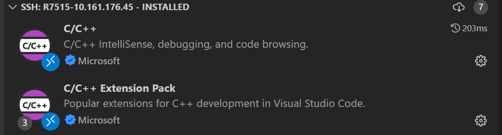
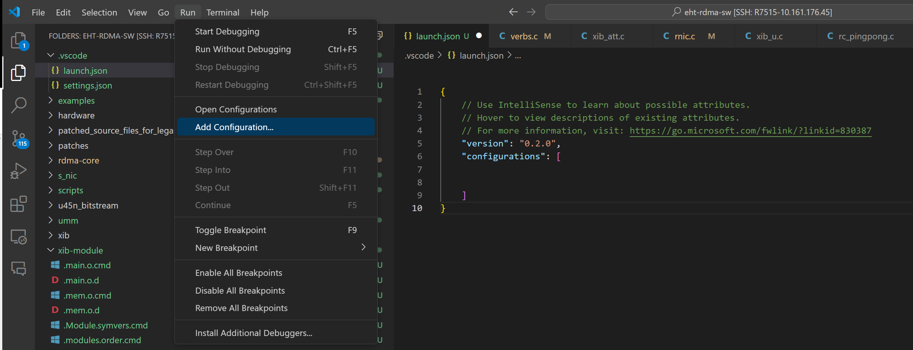
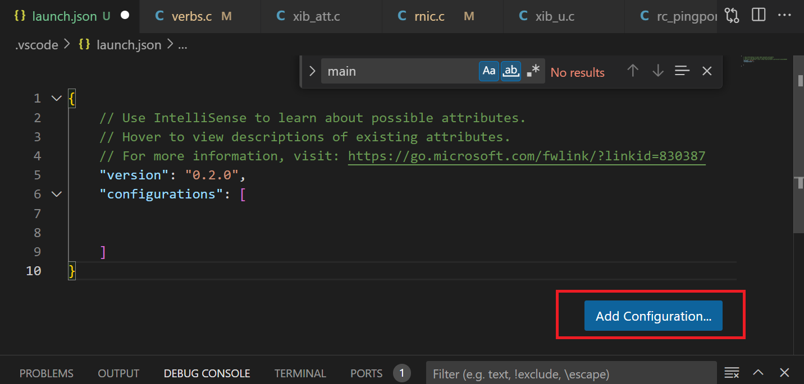
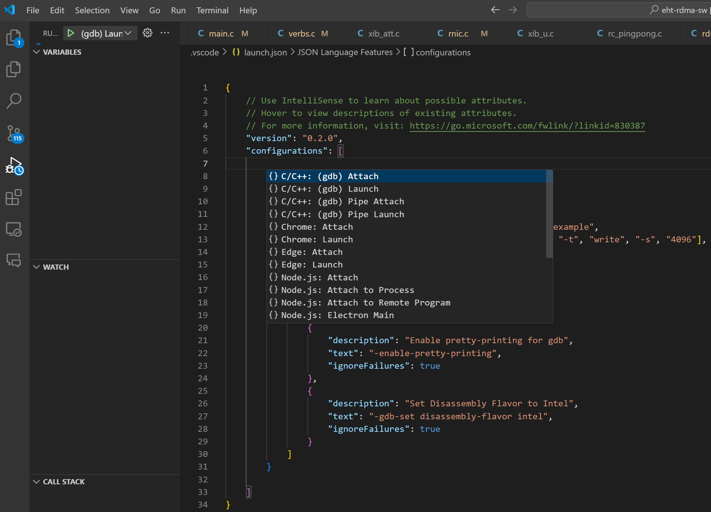
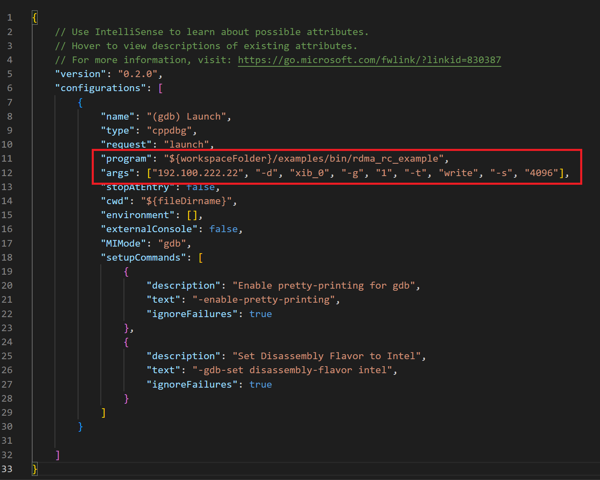
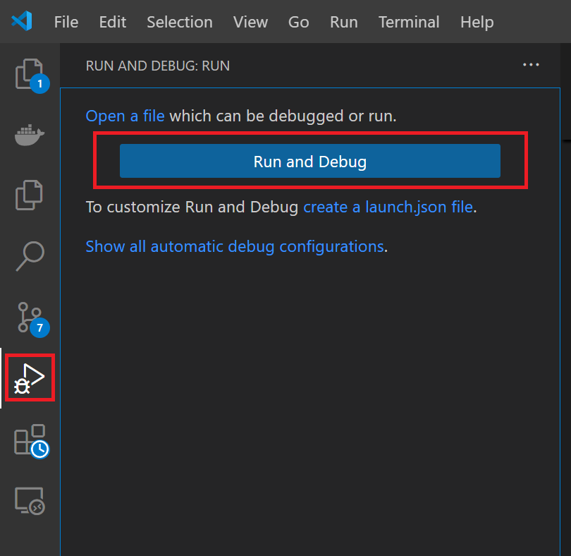

# use_gdb_in_vscode
1 Install Plugin

2 Run -> Add Configuration..., open the launch.json

3 Add configuration....

4 Select the {}C/C++: (gdb) Launch

5 Set program and args

5 run and debug

