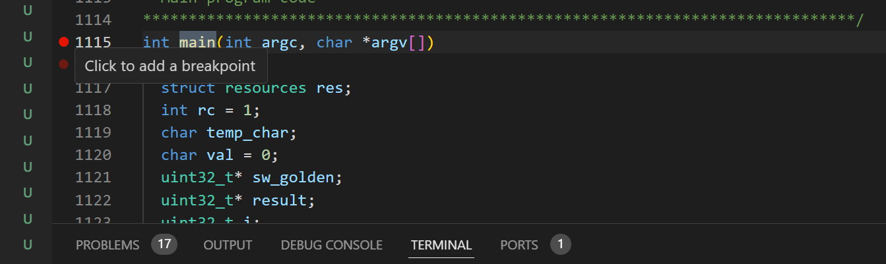
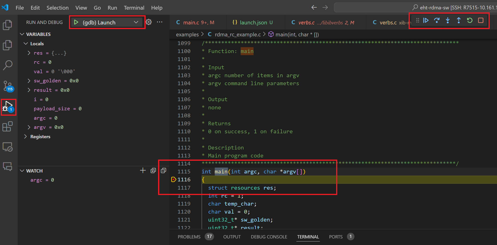

# use_gdb_in_vscode

## this is a tutorial of remote gdb debug a program in VScode

1 Install Plugin

2 Run -> Add Configuration..., open the launch.json

3 Add configuration....

4 Select the {}C/C++: (gdb) Launch

5 Set program and args

note: 

program is the file(with path) of you will execute

for args, use coma and double quotes to seprater each character

for example : 

./bin/rdma_rc_example 192.100.222.22 -d xib_0 -g 1 -t write -s 4096

args is 192.100.222.22 -d xib_0 -g 1 -t write -s 4096

in the json, configure as "args": ["192.168.222.22", "-d", "xib_0", "-g", "1", "-t", "write", "-s", "4096"],

6 Add break points

7 run and debug

