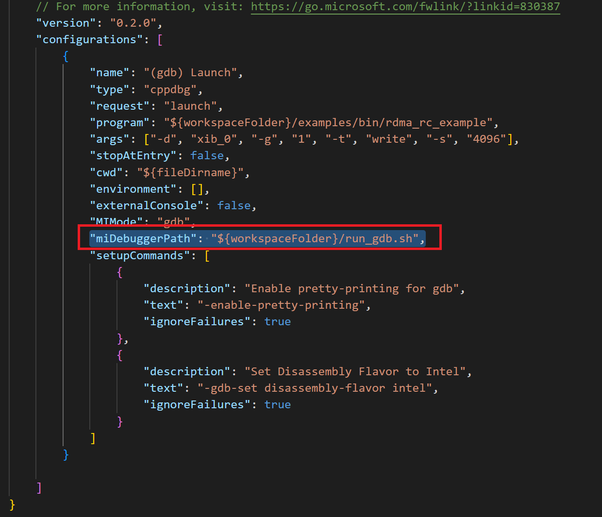

# use_gdb_in_vscode

## this is a tutorial of remote gdb debug a program in VScode

1 Install Plugin

2 Run -> Add Configuration..., open the launch.json

3 Add configuration....

4 Select the {}C/C++: (gdb) Launch

5 Set program and args

note: 

program is the file(with path) of you will execute

for args, use coma and double quotes to seprater each character

for example : 

./bin/rdma_rc_example 192.100.222.22 -d xib_0 -g 1 -t write -s 4096

args is 192.100.222.22 -d xib_0 -g 1 -t write -s 4096

in the json, configure as "args": ["192.168.222.22", "-d", "xib_0", "-g", "1", "-t", "write", "-s", "4096"],

6 Add break points

7 run and debug

8 run with root 

- In the /etc/sudoers add  " <<user_name>>  ALL=(ALL) NOPASSWD: /user/bin/gdb"
- create a file in the current wrokspace ,  name run_gdb.sh

#!/bin/sh

sudo gdb "$@"

- chmod 777 run_gdb.sh
- in the launch.json add "miDebuggerPath": "${workspaceFolder}/run_gdb.sh"

FAQ

sudo 需要密码验证，可以在终端中运行#>sudo -v 命令来缓存密码：

输入 #>sudo -v 后，终端会提示用户输入密码，在接下来的 15 分钟内缓存密码。通过这些步骤，应该能够在 VSCode 中以 sudo 权限运行 gdb 进行调试